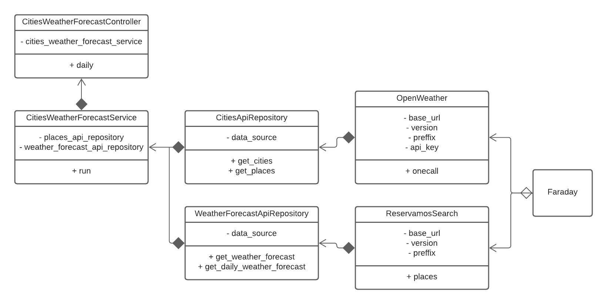

# Cities Weather Forecast App

This is a tech challenge that tests backend developer skills. It consists of merging two APIs, one to search places and another one to get weather forecast such that an endpoint must be exposed to return a list of cities given a query text and each city must have its weather forecast.

- [OpenWeather's API](https://openweathermap.org/api/one-call-api)
- [Reservamos API](https://documenter.getpostman.com/view/6904537/TzRRCo6f)

Please consider that OpenWeather's API requires an API Key.

## Requirements

### Expected output

- An endpoint that receives a city name and return a list of cities with it’s weather forecast:
- Params: Partial or total name of any city in Mexico, e.g: Mon or Monterrey

### Results

- List of cities that match the given param including
the maximum and minimum temperature for the
next 7 days (include only cities into results)

### Scope

- Working endpoint
- It is not required to persist data in a data base, we're only interested in
showing them while using the API.
- User login is not required, anybody can look up weather forecasts.
- This challenge must be built in Ruby on Rails.

## Technology and start-up

### Technology

This project uses the following libraries and ruby version:

- ruby 3.2.2
- rails 7.1.2
- faraday: For http requests
- async: For pararell code
- dotenv-rails: For environment variables management
- rswag: For API Documentation with swagger
- rubocop: For linting and code style

Note: Any database is required.

### Start-up

1. Please install ruby into your machine. We recomend [rvm](https://rvm.io) for manage ruby versions and use the correct one.

2. Create your own .env file using the example template, the only thing that you need to add is the API Key for OpenWeather API.

3. Now run the following commands in a console at the route of current project:

``` sh
bundle install # install dependencies from gem

rails rswag  # generate api documentation

rails s # run server
```

4. To execute the tests just run the following command in a console at the route of current project:

``` sh
rails test
```

## How was this problem addressed?

A simplified UML diagram of how the application was initially designed is shown and how the solution was approached will be explained.



We try to follow the principles of a clean architecture in the project by separating in layers as much as possible all the application logic, as well as a correct use of SOLID principles.

The controller contains the application service and only manages the HTTP layer with parameters and http error handling, as well as the json format of responses.

The service contains most of the application logic. It makes use of repositories to add extensibility to the implementation of a cache in the future. It implements parallelism in the data query to save time in querying the weather forecast for each city.

Current repositories use API Wrappers as data sources, these API Wrappers allow to encapsulate the APIs in simple classes and extensible to more API endpoints. The wrappers make use of the faraday library for HTTP requests, it is simple and customizable, as well as the most recommended within the ruby ecosystem and http request management.

It was solved with this architecture that was gradually improved with the following roadmap:

- Extract common logic from API Wrappers in a mixin utility.
- Use enum for exclude OpenWeather possible value parameters beacuse it can be used in many layers of the app.
- Add common logic for controllers (error responses)
- Add a layer of mappers to simplify the API response by using only the minimum necessary information, these mappers are replaceable and extensible, as well as optional to easily modify the API.

## Good Practices Applied

- Clean arquitecture
- SOLID
- Integration testing (endpoint testing)
- Linter usage
- Github pipelines to testing and linting
- Automatic deployment into render.com PaaS
- Swagger documentation
- Use of pararell programming

## What can be improved in the project

- Use docker for development and testing
- Apply Enum for units type of OpenWeather API
- Extend service to support languages and units by query params
- Extend service to include (optionally) current and alerts weather forecast
- Extend service to support pagination
- Add cache support for most requested queries using redis and popularity data from reservamos api
- Add api versions
